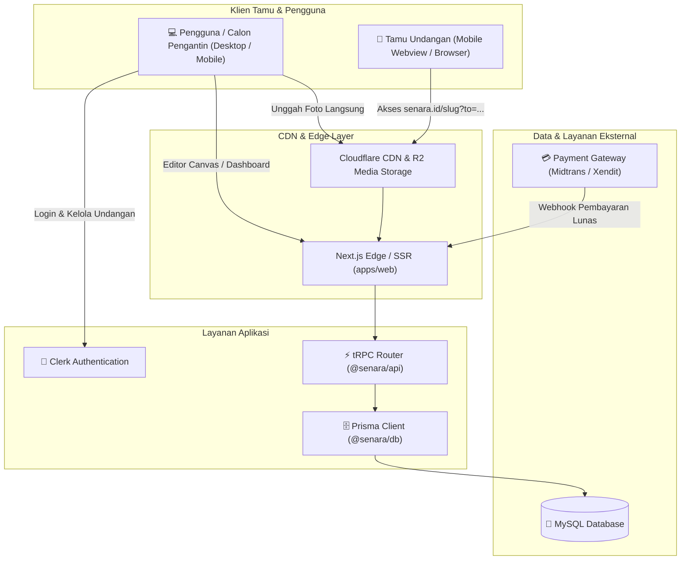
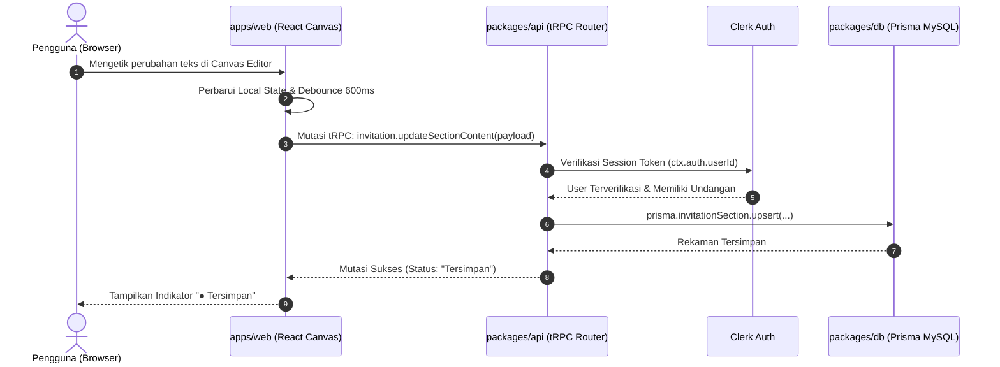
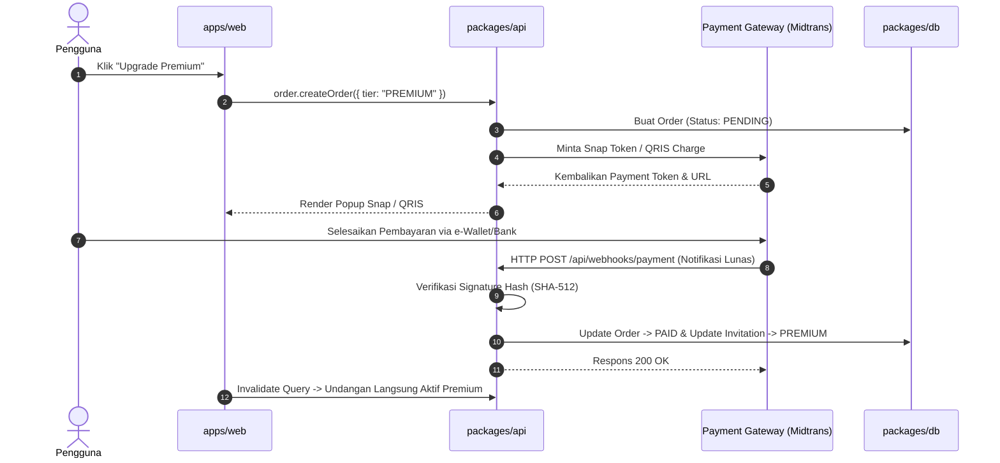

# 🏛️ Arsitektur Sistem Senara

Dokumen ini menjelaskan arsitektur teknis menyeluruh dari platform **Senara**, mencakup pembagian paket monorepo, aliran data end-to-end, arsitektur visual editor, sistem slot template, dan integrasi layanan pihak ketiga.

---

## 1. Diagram Arsitektur Tingkat Tinggi



---

## 2. Struktur Monorepo (Turborepo + Bun)

Senara disusun dalam repositori multi-paket (_monorepo_) dengan pembagian tanggung jawab yang tegas:

```text
senara/
├── apps/
│   └── web/                   # Aplikasi Next.js App Router utama
│       ├── src/app/           # File-system routing (Landing, Dashboard, Editor, [slug])
│       ├── src/components/    # Komponen spesifik web app
│       └── src/utils/         # Client tRPC helper, Clerk hooks, env loaders
│
├── packages/
│   ├── api/                   # Lapisan API tRPC v11
│   │   └── src/
│   │       ├── context.ts     # Injeksi context (Clerk auth + Prisma client)
│   │       ├── index.ts       # Prosedur tRPC (publicProcedure, protectedProcedure)
│   │       └── routers/       # Modul router (invitation, guest, rsvp, template, order)
│   │
│   ├── db/                    # Lapisan ORM & Basis Data
│   │   ├── prisma/schema/     # Skema Prisma MySQL
│   │   └── src/               # Inisialisasi Prisma client instance (@senara/db)
│   │
│   ├── ui/                    # Reusable Design System & Primitives
│   │   ├── src/components/    # Tombol, Dialog, Dropdown, Input, Card (Base UI + Tailwind v4)
│   │   └── src/styles/        # Variabel desain dan tema Tailwind
│   │
│   └── config/                # Konfigurasi bersama (TypeScript, Prettier, ESLint)
```

---

## 3. Aliran Data End-to-End (Data Flow)



---

## 4. Arsitektur Editor Undangan (Visual WYSIWYG)

Editor adalah bagian paling interaktif dalam sistem Senara. Untuk mencapai performa tinggi tanpa lag:

### 4.1 State Management & Optimistic UI

1. **Local State Store:** State undangan disimpan dalam store lokal klien (menggunakan React state / Zustand).
2. **Instant Visual Feedback:** Perubahan teks atau warna langsung diperbarui di DOM canvas tanpa menunggu konfirmasi round-trip dari server.
3. **Debounced Auto-Save:** Setiap mutasi teks dirangkum dan dikirim ke server setelah pengguna berhenti mengetik selama 600ms.
4. **Isolasi Kegagalan:** Jika koneksi server terputus, state lokal tetap utuh, status berubah menjadi `✕ Gagal Menyimpan`, dan dicadangkan ke `localStorage`.

### 4.2 Arsitektur Slot "Isian Kamu" (Dynamic Content Engine)

Bagian "Isian Kamu" tidak disimpan sebagai array visual statis, melainkan terikat pada jangkar logis `slotId`:

```text
[Section: Hero / Cover]
   │
[Section: Couple Profile] ─── Anchor: 'after-couple'
   │                               │
   │                               ├── Block 1: [Judul] "Dress Code"
   │                               └── Block 2: [Teks] "Nuansa Pastel"
   │
[Section: Event Schedule] ─── Anchor: 'after-event'
   │                               │
   │                               └── Block 3: [Peta] Lokasi Tambahan
   │
[Section: RSVP & Guestbook]
```

- **Persistent Slot Rule:** Jika pengguna mematikan visibilitas section `Couple Profile`, blok di slot `after-couple` tidak ikut terhapus. Mesin rendering tetap menampilkan blok tersebut sebelum section aktif berikutnya.
- **Intra-Slot Ordering:** Komponen di dalam satu slot memiliki nilai `sortOrder` (1, 2, 3...) yang dapat ditukar secara independen melalui tombol panah `↑ Naik` / `↓ Turun`.

---

## 5. Arsitektur Halaman Tamu Publik (`/[slug]`) & Audio Autoplay

Halaman tamu publik dirancang untuk menyajikan kecepatan rendering maksimal dengan konsumsi kuota minimal.

### 5.1 Kepatuhan Autoplay (Audio Autoplay Compliance Pattern)

Peramban seluler (Chrome mobile, iOS Safari, browser in-app WhatsApp) memblokir pemutaran musik otomatis tanpa interaksi gestur pengguna.

```text
1. Tamu Membuka Tautan: senara.id/adinda-bagas?to=Budi+Santoso
   │
   ▼
2. Layar Sampul Terkunci (Gate Screen)
   • Pesan Sambutan: "Kepada Yth. Budi Santoso"
   • Scroll halaman dinonaktifkan (overflow: hidden pada body)
   • Tombol Interaktif: [ ✉ Buka Undangan ]
   │
   ▼
3. Tamu Mengklik "Buka Undangan" (User Gesture Valid)
   • Pemicu audio.play() berhasil dieksekusi tanpa diblokir browser
   • Animasi membuka amplop / fade-out cover gate
   • Scroll halaman diaktifkan
   • Floating audio player muncul di sudut bawah
```

---

## 6. Pipeline Media & Cloudflare R2 Storage

Untuk menjaga performa server Next.js dan menghindari batasan payload size:

1. **Presigned Upload:** Klien meminta URL unggah bertanda tangan (_presigned URL_) ke router tRPC `media.getUploadUrl`.
2. **Direct Upload ke R2:** Browser mengunggah file gambar/musik langsung ke bucket Cloudflare R2 menggunakan HTTP PUT.
3. **Penyajian via CDN:** Gambar disajikan melalui domain CDN kustom `cdn.senara.id` dengan kompresi otomatis ke format WebP/AVIF.

---

## 7. Arsitektur Pembayaran & Transaksi (Payment Webhook)


