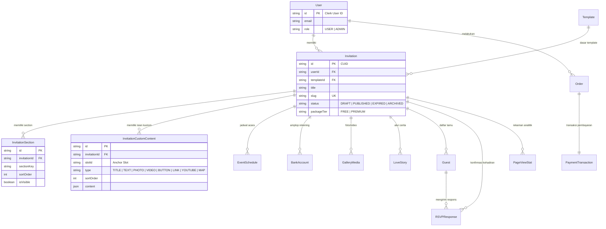

# 🗄️ Spesifikasi Skema Basis Data (Prisma ORM)

Dokumen ini adalah referensi definitif model data relasional **Senara** yang dikelola melalui Prisma ORM dengan basis data target **MySQL** di dalam paket `packages/db`.

---

## 1. Entity Relationship Diagram (ERD)



---

## 2. Rincian Kamus Data (Data Dictionary)

### 2.1 Model `User`
Sinkron dengan data profil pengguna dari penyedia otentikasi Clerk.
- `id` (String, PK): Menggunakan ID pengguna dari Clerk (`user_2...`).
- `email` (String, Unique): Alamat email utama.
- `name` (String, Nullable): Nama tampilan.
- `phone` (String, Nullable): Nomor WhatsApp pengguna.
- `role` (Enum `Role`): `USER` (default) atau `ADMIN`.

### 2.2 Model `Template`
Katalog master desain undangan yang dapat dipilih pengguna.
- `id` (String, PK, CUID)
- `slug` (String, Unique): Pengenal unik URL demo (misal: `kartu-pos-vintage`).
- `name` (String): Nama komersial template (misal: "Kartu Pos Klasik").
- `category` (String): Kategori acara (`WEDDING`, `BIRTHDAY`, `KHITANAN`).
- `thumbnail` (String): URL cover preview template di Cloudflare R2.
- `isPremium` (Boolean): Apakah template memerlukan paket premium.
- `price` (Decimal 10,2): Harga jika dijual secara per-template.
- `isActive` (Boolean): Status aktif di galeri publik.

### 2.3 Model `Invitation`
Entitas inti yang merepresentasikan satu proyek undangan digital milik pengguna.
- `id` (String, PK, CUID)
- `userId` (String, FK): Terhubung ke `User.id` (Cascade delete).
- `templateId` (String, FK): Terhubung ke `Template.id`.
- `title` (String): Judul undangan (misal: "The Wedding of Adinda & Bagas").
- `slug` (String, Unique): Sub-jalur URL publik (`senara.id/[slug]`).
- `status` (Enum `InvitationStatus`): `DRAFT`, `PUBLISHED`, `EXPIRED`, `ARCHIVED`.
- `packageTier` (Enum `PackageTier`): `FREE` atau `PREMIUM`.
- `themeConfig` (Json, Nullable): Overrides palet warna, tipografi, dan gaya tombol.
- `musicUrl` (String, Nullable): URL berkas audio MP3.
- `isMusicAutoplay` (Boolean): Flag pemutaran otomatis setelah tombol Buka Undangan ditekan.
- `publishedAt` (DateTime, Nullable): Waktu pertama kali diterbitkan.
- `expiresAt` (DateTime, Nullable): Tanggal kedaluwarsa draf atau halaman.

### 2.4 Model `InvitationSection` (Manajemen Section Baku)
Mengatur urutan dan status tampil/sembunyi dari section bawaan template.
- `sectionKey` (String): Kunci section (misal: `hero`, `couple`, `event`, `gallery`, `gift`, `rsvp`).
- `sortOrder` (Int): Nilai urutan vertikal (0, 1, 2, ...).
- `isVisible` (Boolean): Sakelar tampilkan / sembunyikan section.
- `isLocked` (Boolean): Jika bernilai `true`, section tidak dapat disembunyikan (misal: Hero Cover).
- `dataPayload` (Json, Nullable): Nilai data spesifik jika disimpan dalam format JSON.
- **Index Unik:** `@@unique([invitationId, sectionKey])` mencegah section ganda.

### 2.5 Model `InvitationCustomContent` (Mesin "Isian Kamu")
Menampung blok konten tambahan kustom yang disisipkan pengguna ke dalam slot template.
- `slotId` (String): Kunci jangkar slot referensi (misal: `after-couple`, `after-event`).
- `type` (Enum `ContentType`): `TITLE`, `TEXT`, `PHOTO`, `VIDEO`, `BUTTON`, `LINK`, `YOUTUBE`, `MAP`.
- `sortOrder` (Int): Urutan item di dalam slot yang sama (*intra-slot order*).
- `content` (Json): Payload data terstruktur per tipe konten.
  - *Contoh format Button:* `{"label": "Lihat Buku Panduan", "url": "https://..."}`
  - *Contoh format Text:* `{"content": "Dress code: Pakaian bernuansa pastel"}`
  - *Contoh format Map:* `{"locationName": "Gedung Serbaguna", "mapsUrl": "https://maps..."}`
- `isVisible` (Boolean): Status aktif/nonaktif isian kustom.
- **Index:** `@@index([invitationId, slotId, sortOrder])`.

### 2.6 Model `Guest` & `RSVPResponse`
- `Guest`: Menyimpan nama tamu, nomor WhatsApp, kategori (Keluarga/VIP), dan flag status kirim pesan.
- `RSVPResponse`: Menyimpan nama tamu pengisi, status kehadiran (`ATTENDING`, `NOT_ATTENDING`, `UNCERTAIN`), jumlah rombongan tamu, serta ucapan doa & harapan.

### 2.7 Model `BankAccount` (Amplop Digital)
- `bankName` (String): Nama bank atau e-wallet (BCA, Mandiri, GoPay).
- `accountNo` (String): Nomor rekening atau nomor akun.
- `accountName` (String): Nama pemilik rekening yang terdaftar.
- `qrisImageUrl` (String, Nullable): URL gambar kode QRIS statis.

---

## 3. Strategi Indexing & Optimasi Query

Untuk memastikan query berkecepatan tinggi pada skala puluhan ribu undangan:
1. `Invitation`: Indeks pada `[userId]` (dashboard lookup) dan `[slug]` (tamu lookup di edge).
2. `InvitationSection`: Indeks komposit `@@unique([invitationId, sectionKey])` dan `@@index([invitationId, sortOrder])`.
3. `InvitationCustomContent`: Indeks komposit `@@index([invitationId, slotId, sortOrder])` untuk memuat konten per slot dengan sangat cepat.
4. `RSVPResponse`: Indeks komposit `@@index([invitationId, createdAt])` untuk pagination ucapan kronologis.

---

## 4. Panduan Eksekusi Migrasi & Seeding

### Langkah 1: Memperbarui Skema di `packages/db`
Edit berkas `packages/db/prisma/schema/schema.prisma` sesuai definisi model di atas.

### Langkah 2: Menjalankan Migrasi
```bash
bun --filter @senara/db run prisma migrate dev --name create_core_models
```

### Langkah 3: Menghasilkan Prisma Client
```bash
bun --filter @senara/db run prisma generate
```

### Langkah 4: Seeding Data Awal
Jalankan script seed (misal untuk menambahkan 3 master template bawaan):
```bash
bun --filter @senara/db run db:seed
```

